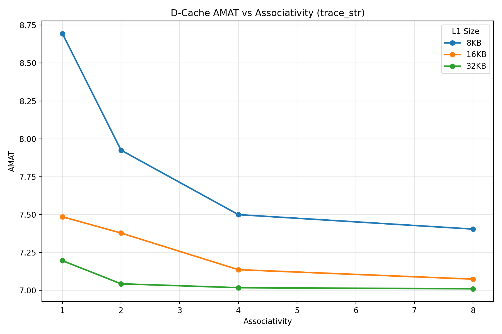
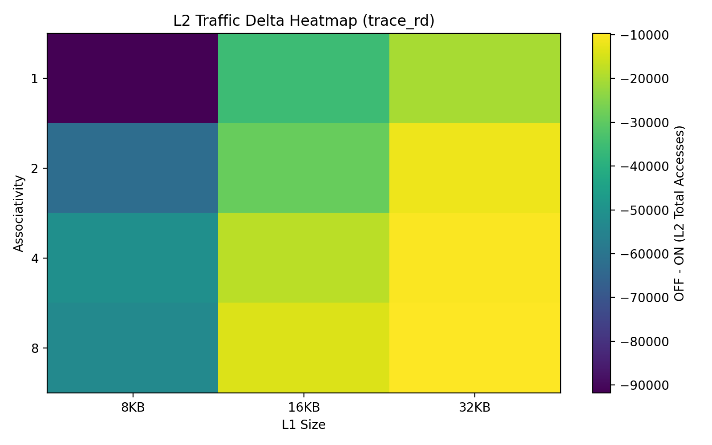
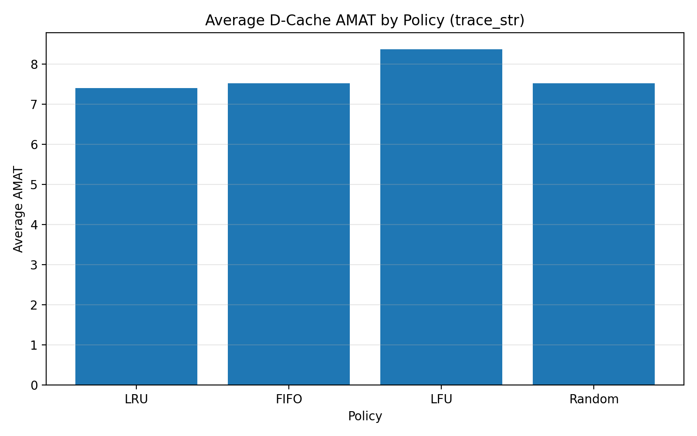

# Cycle-Accurate Parametric Cache Simulator  
A cycle-accurate, parameterizable cache simulator written from scratch in C++. This project models a multi-level memory hierarchy to analyze the impact of architectural constraints such as associativity, capacity, replacement policies, and prefetching on Average Memory Access Time (AMAT) across various workloads.

### Architectural Features
**Multi-Level Hierarchy:** Configurable L1 (Split Instruction/Data) and L2 (Unified) caches.

**Parametric Design:** Highly configurable cache sizing, block sizing, and n-way set associativity.

**Replacement Policies:** Implementation of LRU, FIFO, LFU, and Random eviction strategies.

**Hardware Prefetching:** Toggleable next-line prefetching to analyze bandwidth-vs-latency trade-offs.

### Design Space Exploration & Verification 
To rigorously verify the simulator and explore the design space, I developed an automated testbench using Python. These scripts sweep through thousands of configuration permutations (size, associativity, policies) against sequential, random, and strided memory traces. The output data is automatically parsed to evaluate AMAT, hit/miss rates, and bus traffic, mirroring standard VLSI verification flows.

### Usage
Compilation
Ensure you have a standard C++ compiler installed (e.g., GCC).

For Linux / Mac / WSL:  
`g++ src/*.cpp -o src/cs1op`  
  
For Windows:  
`g++ src/*.cpp -o src/cs1op.exe`  

Running a Simulation
You can run the executable directly via the command line to model specific hardware constraints. 

Linux / Mac / WSL:  
  `
  ./src/cs1op --l1-size 8192 --l1-assoc 4 --l2-size 1048576 --l2-assoc 8 --prefetch ON --policy LRU --trace ./traces/trace_rd.txt
`  
Windows:  
`.\src\cs1op.exe --l1-size 32768 --l1-assoc 8 --l2-size 1048576 --l2-assoc 16 --prefetch ON --policy LRU --trace traces\trace_sq.txt`  

**Sample Terminal Output:**
```text
==================================================================

Instruction Cache (I-Cache) :
--- Cache Simulation Results : L1 cache ---
Total Accesses : 2077327
Reads          : 2077327
Writes         : 0
Cache Hits     : 2069574
Cache Misses   : 7753
Write Backs    : 0
Hit Rate       : 99.6268 %
Miss Rate      : 0.37322 %
AMAT           : 4.16651
Split Accesses : 107303

Replacement Policy used : LRU

====================================================================

==================================================================

Data Cache (D-Cache) :
--- Cache Simulation Results : L1 cache ---
Total Accesses : 729824
Reads          : 533156
Writes         : 196668
Cache Hits     : 682706
Cache Misses   : 47118
Write Backs    : 12542
Hit Rate       : 93.5439 %
Miss Rate      : 6.45608 %
AMAT           : 6.20789
Split Accesses : 148

Replacement Policy used : LRU

====================================================================

==================================================================

Unified L2 Cache :
--- Cache Simulation Results : L2 cache ---
Total Accesses : 108465
Reads          : 95923
Writes         : 12542
Cache Hits     : 96350
Cache Misses   : 12115
Write Backs    : 58
Hit Rate       : 88.8305 %
Miss Rate      : 11.1695 %
AMAT           : 37.339
Split Accesses : 0

Replacement Policy used : LRU

====================================================================

MODIFIED INSTURCTIONS : 10194
```
### Experimental Results & Key Findings
The following conclusions were drawn from automated sweeps across various trace workloads.

**1. Capacity vs. Associativity Trade-offs**  
Associativity acts as a direct counter to conflict misses, but provides diminishing returns after 4-way configurations.

Moving from a Direct-Mapped (1-way) to a 2-way and 4-way cache causes the miss rate to plummet. An 8KB 4-way cache frequently outperforms a larger 16KB 1-way cache under strided access due to the mitigation of conflict misses.

Under random workloads, capacity is the dominating factor. When accesses are unpredictable, capacity Misses bottleneck the system, and increasing associativity provides negligible benefit.



**2. The Impact of Hardware Prefetching**  
A next-line prefetcher is highly workload-dependent and can act as a performance multiplier or a bandwidth bottleneck.

In chaotic workloads lacking spatial locality, prefetching actively degrades L1 hit rates (by evicting demand-paged lines for useless speculative data) and causes massive spikes in L2 overhead traffic.

While prefetching might slightly lower the L1 hit rate in certain sequential boundaries, it drastically improves overall AMAT. The prefetcher overlaps memory latency, meaning that when an L1 miss does occur, the data is already en route from the L2, minimizing the miss penalty.



**3. Eviction Policy Efficiency**  
LRU (Least Recently Used): Yielded the lowest AMAT across all tested workloads. It quickly adapts to micro-localities, efficiently retaining active loop boundaries.

LFU (Least Frequently Used): Suffers from severe "cache pollution." A memory block accessed rapidly in a short burst racks up a high frequency count and remains immune to eviction, while useful new data is kicked out.

FIFO (First-In, First-Out): Indiscriminately kicks out the oldest block, frequently evicting actively modified variables inside loops. This results in severe write-back thrashing compared to LRU.


